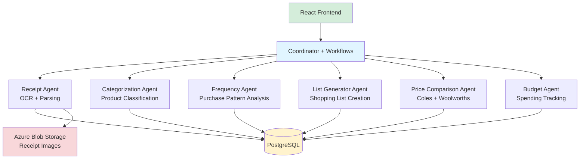

# Agentic Shopper: Smart Shopping Pattern Analyzer & Recommender

> AI-powered grocery shopping assistant that analyzes receipts, tracks purchase patterns, and generates optimized shopping lists with price comparisons across Australian supermarkets (Coles & Woolworths).

[](https://dotnet.microsoft.com/)
[](https://reactjs.org/)
[](https://github.com/microsoft/agent-framework)
[](LICENSE)

## 🎯 What is Agentic Shopper?

Agentic Shopper automates your weekly grocery shopping workflow by:

1. **📸 Receipt Processing**: Upload grocery receipts → AI extracts products via OCR
2. **🏷️ Smart Categorization**: AI categorizes products (Dairy, Produce, Pantry, etc.)
3. **📊 Frequency Tracking**: Learns purchase patterns (Weekly, Fortnightly, Monthly)
4. **🛒 List Generation**: Auto-generates shopping lists based on frequency + household needs
5. **💰 Price Optimization**: Compares prices across Coles & Woolworths, highlights promotions
6. **💵 Budget Tracking**: Monitors spending, sends alerts when approaching budget limits
7. **👨‍👩‍👧‍👦 Family Collaboration**: Shared lists and budgets for household members

**Core Value**: Save time and money by automating shopping list creation while maximizing savings through intelligent price comparison.

---

## 🏗️ Architecture

### Multi-Agent System

Agentic Shopper uses **Microsoft Agent Framework** with 6 autonomous agents coordinated by workflow orchestration:



### Technology Stack

| Layer | Technology | Purpose |
|-------|-----------|---------|
| **Frontend** | React 18 + TypeScript | Modern SPA with real-time updates |
| **Backend** | .NET 10 (C# 12) | High-performance API services |
| **Agent Framework** | Microsoft Agent Framework | Multi-agent orchestration with workflows |
| **AI/LLM** | Foundry Local / Azure AI Foundry | Product categorization, intent analysis |
| **OCR** | Azure AI Document Intelligence | Receipt text extraction |
| **Database** | PostgreSQL 15+ | Receipts, products, purchase history |
| **Storage** | Azure Blob Storage | Receipt image storage |
| **Testing** | xUnit + Jest/React Testing Library | Comprehensive test coverage |
| **Deployment** | Docker + Kubernetes + Azure Container Apps | Multi-environment portability |

### Workflow Orchestration

The coordinator uses **WorkflowBuilder** to orchestrate agents as directed acyclic graphs (DAGs):

#### Receipt Processing Workflow
```
Upload → OCR → Parse → Categorize Products → Calculate Frequencies → Complete
```
- **Sequential execution** with streaming updates
- **Error handling** with automatic rollback
- **Idempotent** (can retry failed steps)

#### Shopping List Generation Workflow
```
Frequency Analysis → [Parallel: Coles Prices | Woolworths Prices] → Optimize List
```
- **Parallel execution** for faster price comparison
- **Aggregates** best prices across stores
- **Optimizes** based on frequency needs + promotions

#### Budget Analysis Workflow
```
Spending Analysis → [If Over Budget: Send Alert] → Summary Dashboard
```
- **Conditional routing** (alerts only when needed)
- **Real-time** budget tracking

---

## 🚀 Getting Started

### Prerequisites

- **.NET 10 SDK**: [Download](https://dotnet.microsoft.com/download/dotnet/10.0)
- **Node.js 20+**: [Download](https://nodejs.org/)
- **PostgreSQL 15+**: [Download](https://www.postgresql.org/download/)
- **Docker** (optional): [Download](https://www.docker.com/products/docker-desktop)
- **Azure Account** (for OCR + Blob Storage): [Free Tier](https://azure.microsoft.com/free/)

### Local Development Setup

#### 1. Clone Repository
```bash
git clone https://github.com/NileshGule/agentic-shopper.git
cd agentic-shopper
```

#### 2. Configure Database
```bash
# Create PostgreSQL database
createdb agentic_shopper

# Update connection string in appsettings.Development.json
# "ConnectionStrings:DefaultConnection": "Host=localhost;Database=agentic_shopper;Username=your_user;Password=your_password"
```

#### 3. Configure Azure Services
```bash
# Set environment variables for Azure services
export AZURE_OPENAI_ENDPOINT="https://your-foundry.openai.azure.com/"
export AZURE_OPENAI_DEPLOYMENT_NAME="gpt-4o-mini"
export AZURE_DOCUMENT_INTELLIGENCE_ENDPOINT="https://your-region.api.cognitive.microsoft.com/"
export AZURE_STORAGE_CONNECTION_STRING="DefaultEndpointsProtocol=https;AccountName=..."
```

#### 4. Run Backend
```bash
cd backend/src/AgenticShopper.Coordinator
dotnet restore
dotnet ef database update --project ../AgenticShopper.Data
dotnet run
```

Backend runs at: `https://localhost:5001`

#### 5. Run Frontend
```bash
cd frontend
npm install
npm start
```

Frontend runs at: `http://localhost:3000`

---

## 🐳 Docker Deployment

### Using Docker Compose (Recommended for Local)

```bash
# Build all services
docker-compose -f backend/deployment/docker/docker-compose.yml build

# Start services (Coordinator + Agents + PostgreSQL)
docker-compose -f backend/deployment/docker/docker-compose.yml up -d

# View logs
docker-compose -f backend/deployment/docker/docker-compose.yml logs -f
```

Services available at:
- **Frontend**: http://localhost:3000
- **API**: http://localhost:5000
- **PostgreSQL**: localhost:5432

### Building Individual Containers

```bash
# Build coordinator
docker build -f backend/deployment/docker/Dockerfile.coordinator -t agentic-shopper-coordinator .

# Build agents
docker build -f backend/deployment/docker/Dockerfile.agent -t agentic-shopper-agents .

# Run coordinator
docker run -p 5000:80 \
  -e AZURE_OPENAI_ENDPOINT="..." \
  -e ConnectionStrings__DefaultConnection="..." \
  agentic-shopper-coordinator
```

---

## ☸️ Kubernetes Deployment

### Deploy to Local Kubernetes (Minikube/Docker Desktop)

```bash
# Apply all manifests
kubectl apply -f backend/deployment/kubernetes/

# Check deployment status
kubectl get pods -n agentic-shopper
kubectl get services -n agentic-shopper

# Access application
kubectl port-forward svc/coordinator-service 5000:80 -n agentic-shopper
```

### Deploy to Azure Kubernetes Service (AKS)

```bash
# Create AKS cluster
az aks create \
  --resource-group agentic-shopper-rg \
  --name agentic-shopper-aks \
  --node-count 3 \
  --enable-managed-identity \
  --generate-ssh-keys

# Get credentials
az aks get-credentials --resource-group agentic-shopper-rg --name agentic-shopper-aks

# Deploy application
kubectl apply -f backend/deployment/kubernetes/

# Get external IP
kubectl get service coordinator-service -n agentic-shopper
```

---

## ☁️ Azure Container Apps Deployment

```bash
# Deploy using Bicep template
az deployment group create \
  --resource-group agentic-shopper-rg \
  --template-file backend/deployment/azure/container-apps.bicep \
  --parameters @backend/deployment/azure/container-apps.parameters.json

# Get application URL
az containerapp show \
  --name agentic-shopper-coordinator \
  --resource-group agentic-shopper-rg \
  --query properties.configuration.ingress.fqdn
```

---

## 🧪 Testing

### Backend Tests
```bash
# Unit tests
cd backend/tests/AgenticShopper.Tests.Unit
dotnet test

# Integration tests
cd backend/tests/AgenticShopper.Tests.Integration
dotnet test

# Contract tests (agent API validation)
cd backend/tests/AgenticShopper.Tests.Contract
dotnet test

# All tests with coverage
dotnet test /p:CollectCoverage=true /p:CoverageReportFormat=opencover
```

### Frontend Tests
```bash
cd frontend

# Unit tests
npm test

# Integration tests
npm run test:integration

# E2E tests
npm run test:e2e

# Coverage report
npm run test:coverage
```

---

## 📖 Project Structure

```
agentic-shopper/
├── backend/
│   ├── src/
│   │   ├── AgenticShopper.Coordinator/      # Workflow orchestration
│   │   ├── AgenticShopper.Agents.*/         # 6 autonomous agents
│   │   ├── AgenticShopper.Core/             # Shared models + abstractions
│   │   └── AgenticShopper.Data/             # EF Core + repositories
│   ├── tests/                               # Unit + Integration tests
│   └── deployment/                          # Docker + K8s + Azure configs
├── frontend/
│   ├── src/
│   │   ├── components/                      # React components
│   │   ├── pages/                           # Page layouts
│   │   ├── services/                        # API clients
│   │   └── hooks/                           # Custom React hooks
│   └── tests/                               # Jest + React Testing Library
├── specs/
│   └── 001-shopping-analyzer/               # Feature specification
│       ├── plan.md                          # Implementation plan (this guides development)
│       ├── spec.md                          # Feature requirements
│       ├── data-model.md                    # Database schema
│       ├── tasks.md                         # Development tasks
│       └── contracts/                       # OpenAPI specs
└── README.md                                # This file
```

---

## 🛠️ Development Workflow

### Current Implementation Status

✅ **Completed** (Phase 1-4):
- User Story 1: Receipt Upload & Processing (FR-001 to FR-009)
- User Story 2: Product Categorization & Frequency (FR-010 to FR-015)
  - Backend: Complete (agents, controllers, services)
  - Frontend: Product categorization & frequency components (T077-T080)
- Multi-agent architecture with Microsoft Agent Framework
- Workflow orchestration with WorkflowBuilder
- PostgreSQL database with EF Core
- Receipt Agent (OCR + parsing)
- Categorization Agent (LLM-powered classification)
- Frequency Agent (pattern analysis)

🚧 **In Progress**:
- User Story 2 Frontend: ProductsPage integration (T081-T085)

📋 **Planned**:
- User Story 3: Shopping List Generation (FR-016 to FR-024)
- User Story 4: Price Comparison & Promotions (FR-025 to FR-032)
- User Story 5: Budget Tracking (FR-033 to FR-039)
- User Story 6: Family Collaboration (FR-040 to FR-045)
- User Story 7: Analytics Dashboard (FR-046 to FR-051)

### Contributing

See [specs/001-shopping-analyzer/plan.md](specs/001-shopping-analyzer/plan.md) for detailed implementation plan and architecture decisions.

---

## 📊 Performance Targets

| Metric | Target | Current |
|--------|--------|---------|
| OCR Processing | <5s per receipt | 🚧 TBD |
| Shopping List Generation | <2s | 🚧 TBD |
| API Response Time (p95) | <200ms | 🚧 TBD |
| Concurrent Users | 1000+ | 🚧 TBD |
| OCR Accuracy | 90%+ | 🚧 TBD |

---

## 🔐 Security & Privacy

- **Authentication**: JWT-based auth (planned - T022)
- **Authorization**: Family-based access control
- **Data Encryption**: TLS in transit, encrypted at rest (Azure Storage)
- **PII Handling**: Receipt images stored securely in Azure Blob Storage
- **API Security**: Rate limiting, CORS policies, input validation

---

## 📝 License

This project is licensed under the MIT License - see the [LICENSE](LICENSE) file for details.

---

## 🙏 Acknowledgments

- **Microsoft Agent Framework**: Workflow orchestration and multi-agent coordination
- **Azure AI Services**: Document Intelligence (OCR) and Foundry (LLM)
- **OpenAI**: GPT models for product categorization
- **PostgreSQL**: Robust relational database
- **React**: Modern frontend framework

---

## 📧 Contact

**Nilesh Gule** - [@NileshGule](https://github.com/NileshGule)

**Project Repository**: [https://github.com/NileshGule/agentic-shopper](https://github.com/NileshGule/agentic-shopper)

---

## 🗺️ Roadmap

### v1.0 (MVP) - Current Focus
- ✅ Receipt upload and OCR processing
- ✅ Product categorization with AI
- ✅ Purchase frequency tracking
- 🚧 Shopping list generation
- 🚧 Basic price comparison

### v1.1 (Planned)
- Family account collaboration
- Real-time list sharing
- Budget alerts and notifications
- Mobile app (React Native)

### v2.0 (Future)
- Recipe suggestions based on inventory
- Meal planning integration
- Barcode scanning support
- Voice assistant integration
- ML-based spending predictions

---

**Last Updated**: December 13, 2025  
**Branch**: `001-shopping-analyzer`  
**Build Status**: 🟢 Passing (Backend) | 🚧 In Progress (Frontend)
