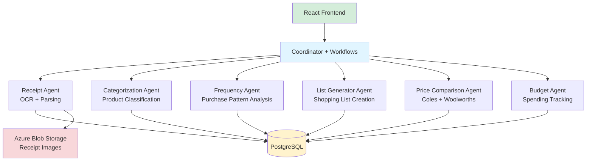

# Agentic Shopper: Smart Shopping Pattern Analyzer & Recommender

> AI-powered grocery shopping assistant that analyzes receipts, tracks purchase patterns, and generates optimized shopping lists with price comparisons across Australian supermarkets (Coles & Woolworths).

[](https://dotnet.microsoft.com/)
[](https://reactjs.org/)
[](https://github.com/microsoft/agent-framework)
[](LICENSE)

## 🎯 What is Agentic Shopper?

Agentic Shopper automates your weekly grocery shopping workflow by:

1. **📸 Receipt Processing** ✅: Upload grocery receipts → AI extracts products via OCR (Azure Document Intelligence)
2. **🏷️ Smart Categorization** ✅: AI categorizes products with GPT-4o-mini (Dairy, Produce, Pantry, etc.) + manual override
3. **📊 Frequency Tracking** ✅: Learns purchase patterns (Weekly, Fortnightly, Monthly) with auto-recalculation
4. **⏸️ Vacation Mode** ✅: Pause/resume frequency tracking for individual products (FR-015)
6. **🛍️ External Purchase Marking** ✅: Mark items purchased outside system to adjust frequencies (FR-021)
7. **🛒 List Generation** ✅: Auto-generates shopping lists based on frequency with urgency indicators
8. **💰 Price Optimization** 📋: Compares prices across Coles & Woolworths, highlights promotions (Planned)
7. **💵 Budget Tracking** 📋: Monitors spending, sends alerts when approaching budget limits (Planned)
8. **👨‍👩‍👧‍👦 Family Collaboration** 📋: Shared lists and budgets for household members (Planned)

**Core Value**: Save time and money by automating shopping list creation while maximizing savings through intelligent price comparison.

---

## 🏗️ Architecture

### Multi-Agent System

Agentic Shopper uses **Microsoft Agent Framework** with 6 autonomous agents coordinated by workflow orchestration:



### Technology Stack

| Layer | Technology | Purpose |
|-------|-----------|---------|
| **Frontend** | React 18 + TypeScript | Modern SPA with real-time updates |
| **Backend** | .NET 10 (C# 12) | High-performance API services |
| **Agent Framework** | Microsoft Agent Framework | Multi-agent orchestration with workflows |
| **AI/LLM** | Foundry Local / Azure AI Foundry | Product categorization, intent analysis |
| **OCR** | Azure AI Document Intelligence | Receipt text extraction |
| **Database** | PostgreSQL 15+ | Receipts, products, purchase history |
| **Storage** | Azure Blob Storage | Receipt image storage |
| **Testing** | xUnit + Jest/React Testing Library | Comprehensive test coverage |
| **Deployment** | Docker + Kubernetes + Azure Container Apps | Multi-environment portability |

### Workflow Orchestration

The coordinator uses **WorkflowBuilder** to orchestrate agents as directed acyclic graphs (DAGs):

#### Receipt Processing Workflow
```
Upload → OCR → Parse → Categorize Products → Calculate Frequencies → Complete
```
- **Sequential execution** with streaming updates
- **Error handling** with automatic rollback
- **Idempotent** (can retry failed steps)

#### Shopping List Generation Workflow
```
Frequency Analysis → [Parallel: Coles Prices | Woolworths Prices] → Optimize List
```
- **Parallel execution** for faster price comparison
- **Aggregates** best prices across stores
- **Optimizes** based on frequency needs + promotions

#### Budget Analysis Workflow
```
Spending Analysis → [If Over Budget: Send Alert] → Summary Dashboard
```
- **Conditional routing** (alerts only when needed)
- **Real-time** budget tracking

---

## 🚀 Getting Started

### Prerequisites

- **.NET 10 SDK**: [Download](https://dotnet.microsoft.com/download/dotnet/10.0)
- **Node.js 20+**: [Download](https://nodejs.org/)
- **PostgreSQL 15+**: [Download](https://www.postgresql.org/download/)
- **Docker** (optional): [Download](https://www.docker.com/products/docker-desktop)
- **Azure Account** (for OCR + Blob Storage): [Free Tier](https://azure.microsoft.com/free/)

### Local Development Setup

#### 1. Clone Repository
```bash
git clone https://github.com/NileshGule/agentic-shopper.git
cd agentic-shopper
```

#### 2. Configure Database
```bash
# Create PostgreSQL database
createdb agentic_shopper

# Update connection string in appsettings.Development.json
# "ConnectionStrings:DefaultConnection": "Host=localhost;Database=agentic_shopper;Username=your_user;Password=your_password"
```

#### 3. Configure Azure Services
```bash
# Set environment variables for Azure services
export AZURE_OPENAI_ENDPOINT="https://your-foundry.openai.azure.com/"
export AZURE_OPENAI_DEPLOYMENT_NAME="gpt-4o-mini"
export AZURE_DOCUMENT_INTELLIGENCE_ENDPOINT="https://your-region.api.cognitive.microsoft.com/"
export AZURE_STORAGE_CONNECTION_STRING="DefaultEndpointsProtocol=https;AccountName=..."
```

#### 4. Run Backend
```bash
cd backend/src/AgenticShopper.Coordinator
dotnet restore
dotnet ef database update --project ../AgenticShopper.Data
dotnet run
```

Backend runs at: `https://localhost:5001`

#### 5. Run Frontend
```bash
cd frontend
npm install
npm start
```

Frontend runs at: `http://localhost:3000`

---

## 🐳 Docker Deployment

### Using Docker Compose (Recommended for Local)

```bash
# Build all services
docker-compose -f backend/deployment/docker/docker-compose.yml build

# Start services (Coordinator + Agents + PostgreSQL)
docker-compose -f backend/deployment/docker/docker-compose.yml up -d

# View logs
docker-compose -f backend/deployment/docker/docker-compose.yml logs -f
```

Services available at:
- **Frontend**: http://localhost:3000
- **API**: http://localhost:5000
- **PostgreSQL**: localhost:5432

### Building Individual Containers

```bash
# Build coordinator
docker build -f backend/deployment/docker/Dockerfile.coordinator -t agentic-shopper-coordinator .

# Build agents
docker build -f backend/deployment/docker/Dockerfile.agent -t agentic-shopper-agents .

# Run coordinator
docker run -p 5000:80 \
  -e AZURE_OPENAI_ENDPOINT="..." \
  -e ConnectionStrings__DefaultConnection="..." \
  agentic-shopper-coordinator
```

---

## ☸️ Kubernetes Deployment

### Deploy to Local Kubernetes (Minikube/Docker Desktop)

```bash
# Apply all manifests
kubectl apply -f backend/deployment/kubernetes/

# Check deployment status
kubectl get pods -n agentic-shopper
kubectl get services -n agentic-shopper

# Access application
kubectl port-forward svc/coordinator-service 5000:80 -n agentic-shopper
```

### Deploy to Azure Kubernetes Service (AKS)

```bash
# Create AKS cluster
az aks create \
  --resource-group agentic-shopper-rg \
  --name agentic-shopper-aks \
  --node-count 3 \
  --enable-managed-identity \
  --generate-ssh-keys

# Get credentials
az aks get-credentials --resource-group agentic-shopper-rg --name agentic-shopper-aks

# Deploy application
kubectl apply -f backend/deployment/kubernetes/

# Get external IP
kubectl get service coordinator-service -n agentic-shopper
```

---

## ☁️ Azure Container Apps Deployment

```bash
# Deploy using Bicep template
az deployment group create \
  --resource-group agentic-shopper-rg \
  --template-file backend/deployment/azure/container-apps.bicep \
  --parameters @backend/deployment/azure/container-apps.parameters.json

# Get application URL
az containerapp show \
  --name agentic-shopper-coordinator \
  --resource-group agentic-shopper-rg \
  --query properties.configuration.ingress.fqdn
```

---

## 🧪 Testing

### Backend Tests
```bash
# Unit tests
cd backend/tests/AgenticShopper.Tests.Unit
dotnet test

# Integration tests
cd backend/tests/AgenticShopper.Tests.Integration
dotnet test

# Contract tests (agent API validation)
cd backend/tests/AgenticShopper.Tests.Contract
dotnet test

# All tests with coverage
dotnet test /p:CollectCoverage=true /p:CoverageReportFormat=opencover
```

### Frontend Tests
```bash
cd frontend

# Unit tests
npm test

# Integration tests
npm run test:integration

# E2E tests
npm run test:e2e

# Coverage report
npm run test:coverage
```

---

## 📖 Project Structure

```
agentic-shopper/
├── backend/
│   ├── src/
│   │   ├── AgenticShopper.Coordinator/      # Workflow orchestration
│   │   ├── AgenticShopper.Agents.*/         # 6 autonomous agents
│   │   ├── AgenticShopper.Core/             # Shared models + abstractions
│   │   └── AgenticShopper.Data/             # EF Core + repositories
│   ├── tests/                               # Unit + Integration tests
│   └── deployment/                          # Docker + K8s + Azure configs
├── frontend/
│   ├── src/
│   │   ├── components/                      # React components
│   │   ├── pages/                           # Page layouts
│   │   ├── services/                        # API clients
│   │   └── hooks/                           # Custom React hooks
│   └── tests/                               # Jest + React Testing Library
├── specs/
│   └── 001-shopping-analyzer/               # Feature specification
│       ├── plan.md                          # Implementation plan (this guides development)
│       ├── spec.md                          # Feature requirements
│       ├── data-model.md                    # Database schema
│       ├── tasks.md                         # Development tasks
│       └── contracts/                       # OpenAPI specs
└── README.md                                # This file
```

---

## 🛠️ Development Workflow

### Current Implementation Status

✅ **Completed** (Phases 1-4 + User Stories 1-2):

**Phase 1-2: Foundational Setup**
- Multi-agent architecture with Microsoft Agent Framework
- Workflow orchestration with WorkflowBuilder
- PostgreSQL database with EF Core migrations
- Azure Blob Storage integration for receipt images
- LLM provider abstraction (Foundry Local + Azure AI Foundry)

**User Story 1: Receipt Processing (FR-001 to FR-009)** ✅
- Receipt Agent with OCR + parsing capabilities
- Azure AI Document Intelligence integration
- Receipt upload with drag-and-drop UI
- Manual review and correction workflow
- Receipt list with filtering and search
- Purchase history tracking

**User Story 2: Product Categorization & Frequency (FR-007 to FR-015)** ✅
- **Backend Implementation:**
  - Categorization Agent (LLM-powered classification with GPT-4o-mini)
  - Frequency Agent (statistical pattern analysis)
  - REST APIs for categorization and frequency operations
  - Batch processing support for multiple products
  - Automatic frequency recalculation on new purchases (FR-014)

- **Frontend Implementation:**
  - ProductsPage with comprehensive product management
  - Real-time search and multi-filter system (all, uncategorized, by category, by frequency)
  - ProductCategorization component with AI suggestions
  - FrequencyAssignment component with pause/resume (vacation mode)
  - Visual indicators for auto vs. manual classification
  - Responsive design with mobile-first approach
  - 837 lines of production-ready TypeScript + CSS

- **Key Features:**
  - 6 purchase frequency options (Weekly, Fortnightly, Monthly, Quarterly, Annually, Occasional)
  - Manual category override with custom category support
  - Pause/resume frequency tracking (vacation mode - FR-015)
  - Background frequency recalculation after receipt upload
  - Type-safe API integration with full error handling

✅ **Completed** (User Story 3 - 100%):

**User Story 3: Shopping List Generation (FR-016 to FR-024)** ✅
- **Backend Implementation:** (Commits 125fe2c, 22a1ac8)
  - ShoppingListRepository with comprehensive CRUD operations
  - ListGeneratorAgent for AI-powered list generation
  - RecommendationEngine with frequency-based product selection
  - UrgencyClassifier for Overdue/DueThisWeek/Upcoming prioritization
  - ListGeneratorController with RESTful API endpoints
  - FrequencyAgent.MarkPurchasedExternallyAsync for external purchases (FR-021)
  - FrequencyController.MarkAsPurchased endpoint
  - Urgency-based sorting (overdue items first)
  - Category grouping in recommendations (FR-018)
  - Shopping list generation workflow orchestration (T098)
  - 1,770+ lines of backend code

- **Frontend Implementation:** (Commits 7b8a120, 22a1ac8)
  - Shopping List API client with full CRUD operations
  - ListGenerator component with urgency filter settings
  - ListEditor component with category grouping and progress tracking
  - ShoppingListsPage with two-column layout
  - FrequencyAssignment enhancement with external purchase marking (FR-021)
  - Date picker for marking purchases with validation (max=today)
  - ProductsPage integration with handleMarkPurchased callback
  - Color-coded urgency indicators (⚠️ Overdue, ⏰ Due, 📅 Upcoming)
  - Manual item addition to lists (FR-019)
  - Purchase status tracking with optimistic updates
  - 1,816+ lines of frontend code

- **Key Features:**
  - External purchase tracking without receipt upload
  - Automatic frequency recalculation on external purchases
  - Complete shopping list generation workflow
  - Urgency-based product recommendations

📋 **Planned** (User Stories 4-7):

- **User Story 4**: Price Comparison & Promotions (FR-025 to FR-032)
  - Price Comparison Agent with Coles/Woolworths integration
  - Promotional pricing display
  - Multi-store optimization recommendations
  - Weekly promotion data refresh

- **User Story 5**: Budget Tracking (FR-033 to FR-039)
  - Budget Agent with spending analysis
  - Category-based budget allocation
  - Alert system for budget thresholds
  - Spending trends visualization

- **User Story 6**: Family Collaboration (FR-040 to FR-045)
  - Multi-user family accounts
  - Shared shopping lists with real-time sync
  - Role-based permissions
  - Collaborative editing

- **User Story 7**: Analytics Dashboard (FR-046 to FR-051)
  - Visual spending analytics
  - Category breakdowns
  - Purchase frequency insights
  - Historical trend analysis

### Contributing

See [specs/001-shopping-analyzer/plan.md](specs/001-shopping-analyzer/plan.md) for detailed implementation plan and architecture decisions.

---

## 📊 Performance Targets

| Metric | Target | Current |
|--------|--------|---------|
| OCR Processing | <5s per receipt | 🚧 TBD |
| Shopping List Generation | <2s | 🚧 TBD |
| API Response Time (p95) | <200ms | 🚧 TBD |
| Concurrent Users | 1000+ | 🚧 TBD |
| OCR Accuracy | 90%+ | 🚧 TBD |

---

## 🔐 Security & Privacy

- **Authentication**: JWT-based auth (planned - T022)
- **Authorization**: Family-based access control
- **Data Encryption**: TLS in transit, encrypted at rest (Azure Storage)
- **PII Handling**: Receipt images stored securely in Azure Blob Storage
- **API Security**: Rate limiting, CORS policies, input validation

---

## 📝 License

This project is licensed under the MIT License - see the [LICENSE](LICENSE) file for details.

---

## 🙏 Acknowledgments

- **Microsoft Agent Framework**: Workflow orchestration and multi-agent coordination
- **Azure AI Services**: Document Intelligence (OCR) and Foundry (LLM)
- **OpenAI**: GPT models for product categorization
- **PostgreSQL**: Robust relational database
- **React**: Modern frontend framework

---

## 📧 Contact

**Nilesh Gule** - [@NileshGule](https://github.com/NileshGule)

**Project Repository**: [https://github.com/NileshGule/agentic-shopper](https://github.com/NileshGule/agentic-shopper)

---

## 🗺️ Roadmap

### v1.0 (MVP) - Current Focus
- ✅ Receipt upload and OCR processing
- ✅ Product categorization with AI
- ✅ Purchase frequency tracking
- ✅ Shopping list generation
- 🚧 Price comparison and promotions (83% complete)

### v1.1 (Planned)
- Family account collaboration
- Real-time list sharing
- Budget alerts and notifications
- Mobile app (React Native)

### v2.0 (Future)
- Recipe suggestions based on inventory
- Meal planning integration
- Barcode scanning support
- Voice assistant integration
- ML-based spending predictions

---

**Last Updated**: December 13, 2025  
**Branch**: `001-shopping-analyzer`  
**Build Status**: 🟢 Passing (Backend) | 🟢 Passing (Frontend)

**Recent Updates:**

**Commit 922d1dd** (User Story 4 - T125 & T129):
- ✅ Promotion indicators in ListEditor component
- ✅ Automatic promotion lookup for all shopping list items
- ✅ Discount percentage badges (e.g., '25% OFF at Coles')
- ✅ Store-specific promotion display (Coles/Woolworths colors)
- ✅ Product name fuzzy matching for promotion detection
- ✅ Best promotion selection (highest discount per product)
- ✅ Promotion expiry date indicators with smart formatting
- ✅ Dynamic countdown ('Expires today', 'in X days', etc.)
- ✅ Non-blocking promotion loading (errors don't break UI)
- ✅ Enhanced ListEditor with 82 additional lines
- ✅ User Story 4: 83% Complete (19/23 tasks)

**Commit b880369** (User Story 4 - T123-T128 Frontend):
- ✅ priceApi TypeScript client for price comparison API (210 lines)
- ✅ getCurrentPromotions with filtering, pagination, product search
- ✅ comparePrices for multi-product comparison across stores
- ✅ comparePricesForList convenience method for shopping lists
- ✅ getBestShoppingOption helper with split strategy analysis
- ✅ Full TypeScript interfaces matching backend DTOs
- ✅ PriceComparison React component (291 lines)
- ✅ Product-by-product comparison table with Coles vs Woolworths
- ✅ Promotion indicators with discount percentage badges
- ✅ Original/sale price display with strikethrough
- ✅ Best price highlighting with color-coded store badges
- ✅ Savings summary card with gradient design
- ✅ Split shopping strategy display with item-by-store lists
- ✅ Responsive CSS with mobile-first design (382 lines)
- ✅ Loading/error states with retry functionality
- ✅ 883 lines of frontend price comparison code
- ✅ User Story 4: 74% Complete (17/23 tasks)

**Commit 2326973** (User Story 4 - T119-T121):
- ✅ PromotionRefreshJob background service for weekly catalog updates (114 lines)
- ✅ IHostedService implementation runs every Sunday at 1:00 AM UTC
- ✅ ShouldRefreshNow logic for scheduled execution matching catalog update cycles
- ✅ Hourly check interval with 30-minute retry on errors
- ✅ Graceful shutdown handling for clean service termination
- ✅ Integration with PriceAgent.RefreshPromotionsAsync method
- ✅ T120: Product name fuzzy matching verified (exact + partial match)
- ✅ T121: Optimal shopping strategy calculation verified (single vs split)
- ✅ User Story 4: 52% Complete (12/23 tasks)

**Commit 7041572** (User Story 4 - T114-T115):
- ✅ PriceOptimizer service for savings calculation (258 lines)
- ✅ CalculateOptimalStrategy for single-store vs split strategy analysis
- ✅ Single-store totals (Coles-only vs Woolworths-only)
- ✅ Split strategy with per-product store selection for maximum savings
- ✅ $5 threshold for split recommendation (avoid minor savings with extra trip)
- ✅ CalculateProductSavings for individual product price differences
- ✅ CalculatePromotionSavings for total promotion benefits across all products
- ✅ ProductPriceInfo, OptimalStrategy, ProductPurchase DTOs
- ✅ PriceController with RESTful API endpoints (299 lines)
- ✅ GET /api/v1/promotions/current (filtering, pagination, product search)
- ✅ POST /api/v1/prices/compare (multi-product comparison)
- ✅ POST /api/v1/promotions/refresh (manual catalog refresh)
- ✅ Request/Response DTOs matching OpenAPI specification
- ✅ Full error handling, logging, and status codes
- ✅ 557 lines of optimizer + controller code
- ✅ User Story 4: 39% Complete (9/23 tasks)

**Commit 1a0778b** (User Story 4 - T110-T113):
- ✅ PriceAgent implementation with price comparison orchestration (369 lines)
- ✅ Request/Response classes: PriceComparisonRequest, CurrentPromotionsRequest, PriceComparisonResponse
- ✅ ComparePricesAsync for multi-product price comparison across stores
- ✅ GetCurrentPromotionsAsync with filtering, pagination, and search
- ✅ RefreshPromotionsAsync for weekly catalog updates from all stores
- ✅ Split strategy calculation for optimal shopping (FR-026)
- ✅ ColesCatalogService implementation (179 lines)
- ✅ WoolworthsCatalogService implementation (179 lines)
- ✅ IStoreCatalogService interface with FetchPromotionsAsync and SearchPromotionAsync
- ✅ Mock promotion data for development (TODO: web scraping)
- ✅ Fuzzy product name matching for promotion search
- ✅ ISO week calculation for catalog week identifiers
- ✅ 794 lines of price comparison infrastructure
- ✅ User Story 4: 30% Complete (7/23 tasks)

**Commit 2708077** (User Story 4 - T107-T109):
- ✅ Promotion entity model with all required properties
- ✅ EF Core indexes for NormalizedProductName+StoreName and CatalogWeek
- ✅ PromotionRepository with comprehensive CRUD operations
- ✅ Query methods: GetActivePromotionsAsync, GetByStoreAsync, SearchByProductNameAsync
- ✅ Bulk operations: BulkAddAsync, DeleteExpiredPromotionsAsync
- ✅ Support for weekly promotion refresh (FR-027)
- ✅ 293 lines of repository code
- ✅ User Story 4: 13% Complete (3/23 tasks)

**Commit 22a1ac8** (User Story 3 - T097-T098 Completion):
- ✅ External purchase marking implementation (FR-021)
- ✅ FrequencyAgent.MarkPurchasedExternallyAsync backend method
- ✅ FrequencyController.MarkAsPurchased API endpoint (POST /api/frequency/{productId}/mark-purchased)
- ✅ frequencyApi.markAsPurchasedExternally frontend client method
- ✅ FrequencyAssignment component with date picker UI for external purchases
- ✅ ProductsPage integration with handleMarkPurchased callback
- ✅ Shopping list generation workflow orchestration (T098)
- ✅ Automatic frequency recalculation on external purchases
- ✅ User Story 3: 100% Complete (T086-T106)
- ✅ 196+ lines of new code across 6 files

**Commit 7b8a120** (User Story 3 - Frontend):
- ✅ Shopping List API client with TypeScript interfaces (shoppingListApi.ts)
- ✅ ListGenerator component with urgency filters and custom naming
- ✅ ListEditor component with category grouping and progress tracking
- ✅ ShoppingListsPage with two-column responsive layout
- ✅ Color-coded urgency indicators (Overdue/DueThisWeek/Upcoming)
- ✅ Manual item addition and purchase status tracking (FR-019)
- ✅ Optimistic UI updates for better UX
- ✅ 1,620 lines of production-ready TypeScript + CSS

**Commit 125fe2c** (User Story 3 - Backend):
- ✅ ShoppingListRepository with CRUD and custom queries
- ✅ ListGeneratorAgent for AI-powered list generation
- ✅ RecommendationEngine with frequency-based selection logic
- ✅ UrgencyClassifier with ratio-based thresholds
- ✅ ListGeneratorController with RESTful endpoints
- ✅ Category grouping and urgency-based sorting (FR-018)
- ✅ 1,575 lines of backend implementation

**Commit 7c319b6** (User Story 2 - Frontend):
- ✅ ProductsPage with search, filters, and product management (331 lines)
- ✅ Product API client with 8 CRUD operations (143 lines)
- ✅ Responsive CSS with mobile-first design (270 lines)
- ✅ Background frequency recalculation on receipt upload
- ✅ Type-safe PurchaseFrequency enum/union for TypeScript
- ✅ Full integration of ProductCategorization and FrequencyAssignment components
- ✅ Auto/manual visual indicators with emoji badges (🤖 vs 👤)

**Implementation Progress**:
- Tasks Completed: T001-T129 (129/489 tasks = 26%)
- User Stories: 3 Complete ✅ | 1 In Progress 🚧 (US4: 83%) | 3 Planned 📋
- Backend Agents: 5/6 (Receipt ✅, Categorization ✅, Frequency ✅, ListGenerator ✅, PriceComparison 🚧)
- Frontend Pages: 4/6 (Receipts ✅, Products ✅, Shopping Lists ✅, Price Comparison 🚧)
- Lines of Code: ~21,300+ (backend + frontend)
